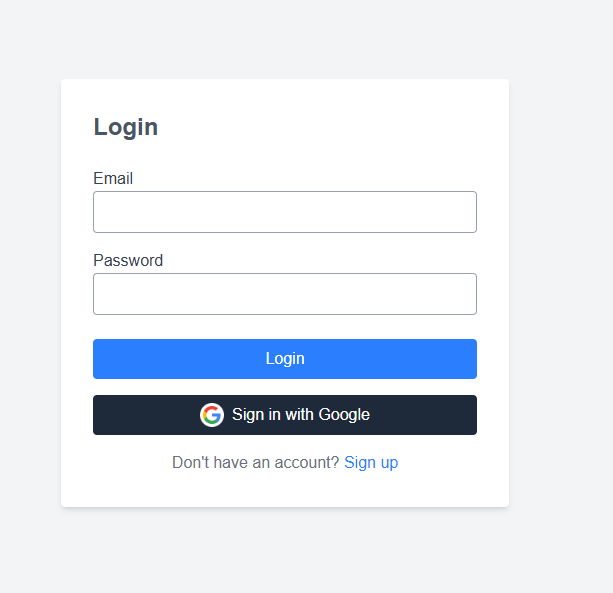
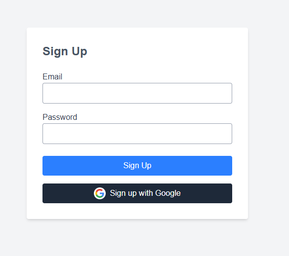
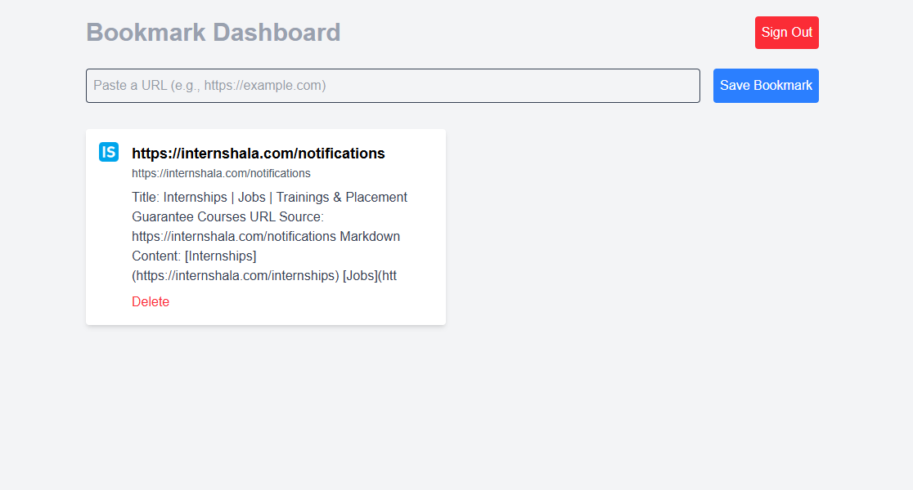

# Link Saver + Auto-Summary

A full-stack web application that allows users to sign up, log in (via email/password or Google), save website bookmarks, and view auto-generated summaries of the bookmarked pages. Built as a take-home assignment for an internship, this app demonstrates clean code, intuitive UI/UX, and integration with external APIs.

## Tech Stack
- **Frontend**: Next.js (React) with App Router, Tailwind CSS for responsive styling
- **Backend**: Next.js API Routes
- **Database**: MongoDB (via MongoDB Atlas) for storing bookmarks
- **Authentication**: Firebase Authentication (Email/Password and Google Sign-In)
- **External API**: Jina AI (`r.jina.ai`) for generating webpage summaries
- **Testing**: Jest for unit tests
- **Deployment**: Vercel (for live demo)

## Setup
To run the app locally, follow these steps:

1. **Clone the repository**:
   ```bash
   git clone https://github.com/your-username/link-saver.git
   cd link-saver
   ```

2. **Install dependencies**:
   ```bash
   npm install
   ```

3. **Set up environment variables**:
   Create a `.env.local` file in the root directory and add:
   ```env
   MONGODB_URI=your_mongodb_connection_string
   ```
   Update `lib/firebase.js` with your Firebase configuration:
   ```javascript
   const firebaseConfig = {
     apiKey: "YOUR_API_KEY",
     authDomain: "YOUR_AUTH_DOMAIN",
     projectId: "YOUR_PROJECT_ID",
     storageBucket: "YOUR_STORAGE_BUCKET",
     messagingSenderId: "YOUR_MESSAGING_SENDER_ID",
     appId: "YOUR_APP_ID",
   };
   ```

4. **Run the development server**:
   ```bash
   npm run dev
   ```
   Open `http://localhost:3000` in your browser.

5. **Run tests**:
   ```bash
   npm test
   ```

## Live Demo
[Link to Vercel deployment](https://your-vercel-app.vercel.app) *(Update with your actual deployment URL)*

## Screenshots
- **Login Page**: Features email/password login, Google Sign-In with logo, and a link to the signup page.
  
- **Signup Page**: Allows email/password signup and Google Sign-In with logo.
  
- **Dashboard**: Displays a responsive grid of bookmarks with titles, favicons, summaries, and delete buttons.
  

## What I'd Do Next
- **Tag Filtering**: Add a tagging system for bookmarks and a filter dropdown.
- **Dark Mode**: Implement a dark theme using Tailwind CSS’s `dark` class.
- **Drag-and-Drop Reordering**: Enable reordering bookmarks with a library like `react-beautiful-dnd`.
- **Enhanced Error Handling**: Cache summaries locally to handle Jina AI API downtime better.
- **More Tests**: Add end-to-end tests with Cypress or Playwright.

## Time Spent
Approximately **4.5 hours**, broken down as:
- Setup and configuration: ~30 minutes
- Authentication (Firebase, Google Sign-In): ~1 hour
- Bookmark saving and Jina AI API integration: ~1.5 hours
- UI/UX and responsive design: ~1 hour
- Testing, deployment, and README: ~30 minutes

## Notes
- **Google Authentication**: Integrated Firebase’s Google Sign-In with a custom button featuring the Google logo, enhancing UX.
- **Jina AI API**: Handles the 60 calls/hour limit with a fallback message (“Summary temporarily unavailable”) for graceful degradation.
- **Unit Tests**: Included a basic URL validation test in `__tests__/url.test.js`. More tests could be added with additional time.
- **Commit History**: Used small, logical commits (e.g., “Add Firebase auth”, “Implement bookmark saving”) for clarity.
- **UI/UX**: Focused on a clean, responsive design with Tailwind CSS, ensuring intuitive navigation (e.g., signup link on login page).

For any questions or issues, contact [gautam@omvad.com](mailto:gautam@omvad.com).

Happy evaluating! 🚀